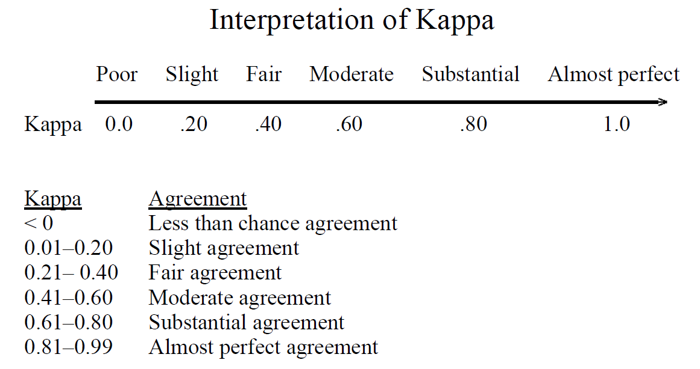

# Cohen's Kappa Calculations
This tool is CLAMP specific. It is designed to calculate pair-wise Cohen's Kappa statistics for 2 raters for multiple annotation labels. The basic workflow of this tool is as follows:

1. Parse `.xmi` files. Thanks to Huy Anh Pham for this work.
1. Convert annotations to `pd.DataFrame` objects
1. Calculate Kappa scores

## Usage
This is a python3 command line tool, with not intention of backwards compatibility. The program has two mandatory arguments:

1. `--p`: directory containing `.xmi` files for rater 1.
1. `--q`: directory containing `.xmi` files for rater 2. Note, Cohen's Kappa is symmetrical, so order does not matter.

In addition, there is an optional flag to print a summary to the console: `--print`.

The program can be invoked like this:

```
python3 calculate_kappa --p annotations/Marcy/ --q annotations/Madhuri/ --print
```

Output with be saved to the [outputs/](outputs/) folder with runtime date.


## Interpretation
The image below is from [2].


### Citations
1. J. Cohen (1960). “A coefficient of agreement for nominal scales”. Educational and Psychological Measurement 20(1):37-46. doi:10.1177/001316446002000104.
1. Ziai A. Inter-rater agreement Kappas [Internet]. Towards Data Science. 2017 [cited 2019 Jul 11]. Available from: https://towardsdatascience.com/inter-rater-agreement-kappas-69cd8b91ff75
